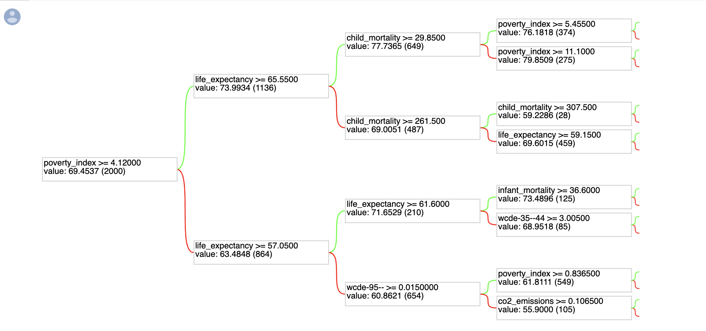

# education-impact
A ML model to find which factors influence the development of the country the most

## Approach
Initially we tried to predict country's development factors 40 years ahead, but due to data unavailability ,it's not feasible approach

Now we are trying to predict development factors 5-10 years ahead and we are considering only education levels of 20-25 age group people, reason for this approach i
in general most of the population education level reaches saturation point by the time they reach 25 and from 25 they start to contribute to the society ( working )
in this way by predicting 5-10 yrs ahead we can check how education is impacting the country's development

## Random Forest
### First Attempt
We trained a TensorFlow RandomForest without any data interpolation

train : test = 70 : 30

total data points : 2834

prediction years = 40
#### model performance:

"malnutrition","maternal_mortality","people_in_poverty"  were not used by the model.

**MSE** : 5.545248985290527

**RMSE**: 2.354835235274546
 

 ### Second Attempt
We trained a TensorFlow RandomForest with WCDE datasets, data interpolation

train : test = 70 : 30

total data points : 2834

prediction years = 40
#### model performance:

"malnutrition","maternal_mortality","people_in_poverty"  were not used by the model.

**MSE** : 3.8452484607696533

**RMSE**: 1.9609305089088835
 
