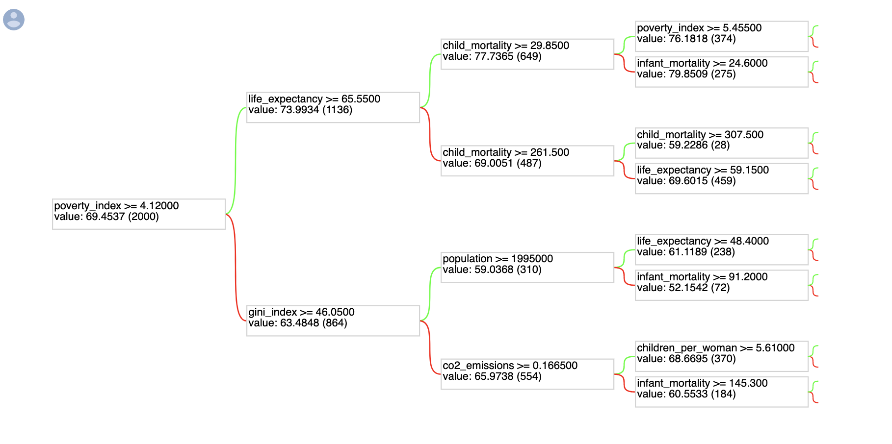

# education-impact
A ML model to find which factors influence the development of the country the most

## Random Forest
### First Attempt
We trained a TensorFlow RandomForest without any data interpolation
train : test = 70 : 30
total data points : 2834
**model performance:**
WARNING:absl:Registering feature "malnutrition","maternal_mortality","people_in_poverty" not used by the model.

**MSE**: 5.545248985290527
**RMSE**: 2.354835235274546
 